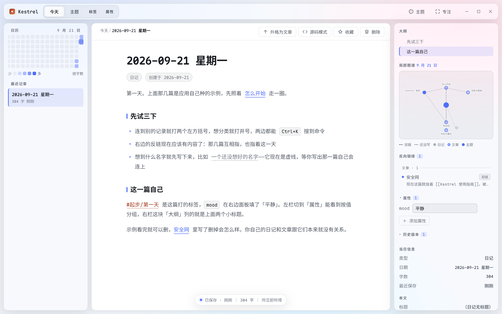
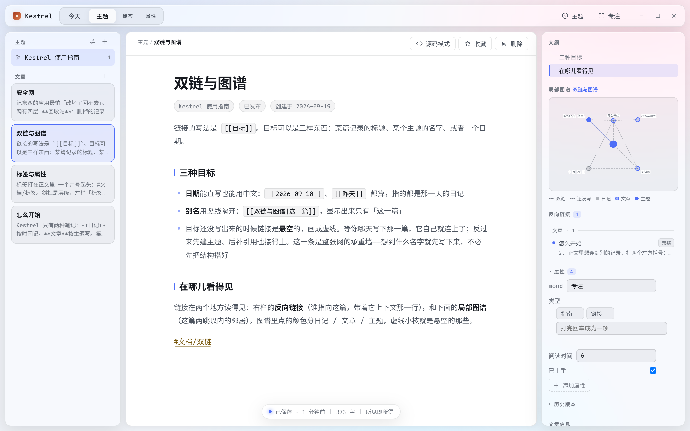
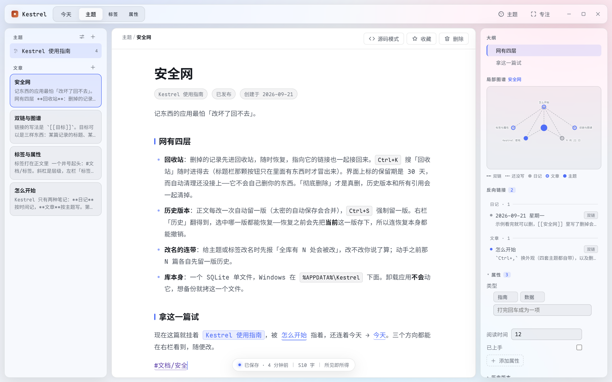
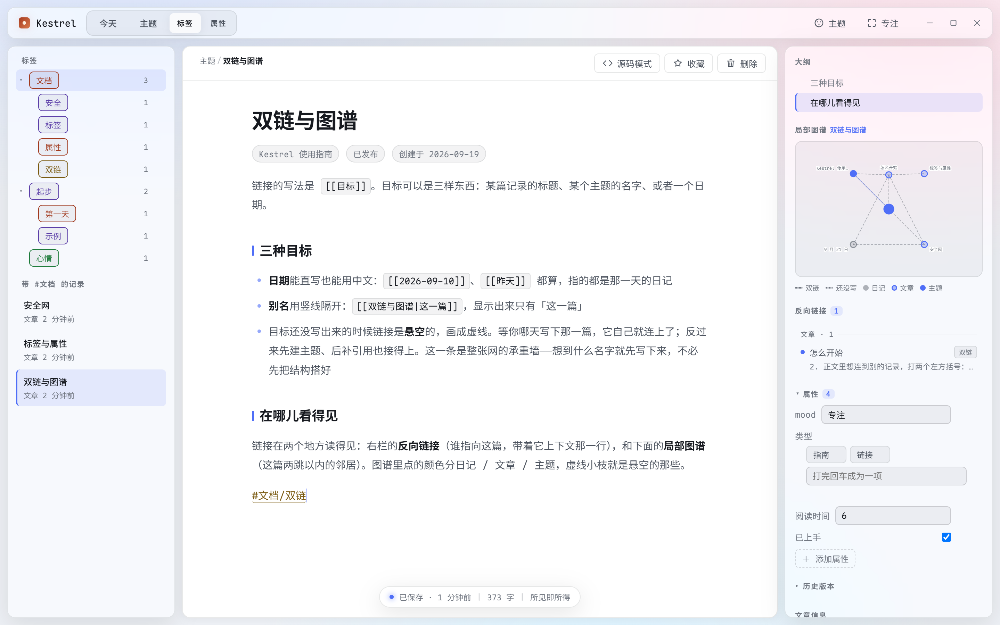
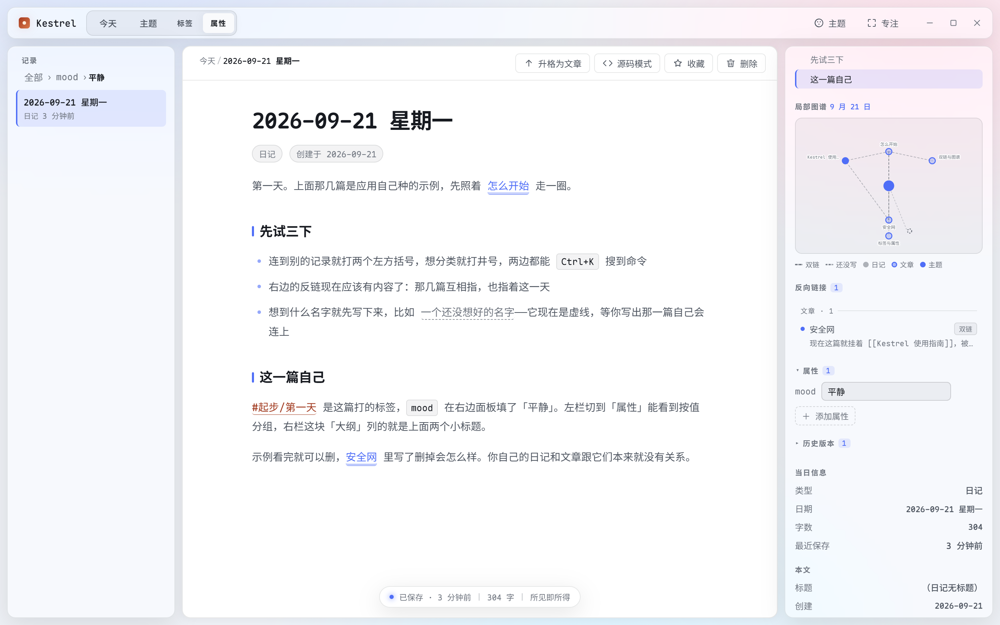
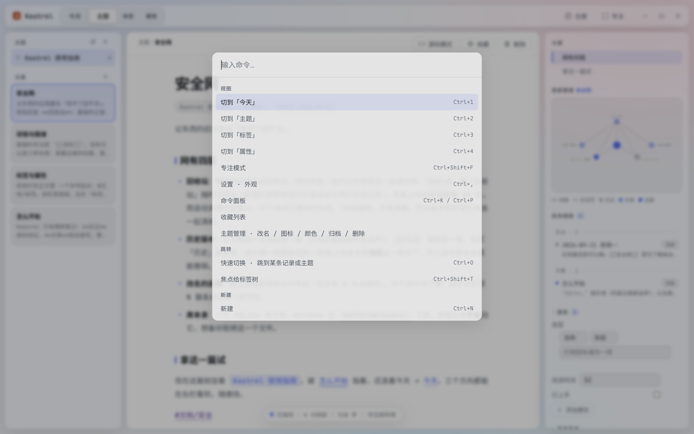

# Kestrel

> 把「按时间记的日记」和「按主题写的文章」放在同一个屋顶下的本地优先笔记软件。



- **数据只有一个文件**：SQLite，Windows 下在 `%APPDATA%\Kestrel\kestrel.db`。不需要账号，不需要联网。
- **零网络请求**：整个应用不发起任何对外请求——没有统计、没有更新检查、没有云。字体是打包进安装包的。正文里的 http 链接被点击时交给系统浏览器打开，应用内不开新窗口。
- **卸载不会删你的日记**：卸载程序被明确配置成不动 `%APPDATA%\Kestrel`。

当前版本 **v0.1.0**（基线版，大版本号还是 0）。它已经是一个每天能用起来的工具，但它还不是一个成熟产品——已知的边界写在[非目标](#非目标)里。

---

## 它解决的是什么问题

大多数笔记软件只给你一种组织方式：要么是一棵文件夹树，要么是一堆标签。而人的记录欲其实有两种完全不同的形状——

- **日记**：今天发生了什么，按日期走，不关心它属于哪个主题。
- **文章**：关于某件事我一直怎么想，按主题走，日期不重要。

Kestrel 把这两种形状做成了一等公民，用同一种笔记体（`[[双链]]`）把它们缝起来：日记里写下的想法可以**升格**成文章，一个字都不用重打；文章里也可以直接指回某一天。

## 界面

左边是导航（今天 / 主题 / 标签 / 属性 四格），中间是正文，右边是当前记录的上下文（大纲、反向链接、局部图谱、属性、历史）。

| 今天 | 主题 |
| --- | --- |
|  |  |
| **按日期落笔，自动保存** | **一个主题下的一组文章** |

| 双链与图谱 | 标签与属性 |
| --- | --- |
|  |  |
| **两跳以内的邻居，虚线是悬空链接** | **嵌套标签树 + 按属性值分组** |

| 属性 | 命令面板 |
| --- | --- |
|  |  |
| **按类型存的元信息，侧栏按值分组** | **`Ctrl+K` 一条入口，与快捷键同源** |

四套外观主题（玻璃拟态 + Maple Mono），`Ctrl+,` 切换，也可以跟随系统。
删东西之前先问一句、回收站里能恢复、极夜那套暗色，这几张在[官网](https://fangjj1008.github.io/kestrel/)上还有。

## 功能

### 记录

- **日记**按日期建，一天一篇；**文章**挂在主题下面。
- **自动保存**：停下来半秒就落盘，状态条会写「已保存」。`Ctrl+S` 强制存并留一版历史。
- **三种编辑器模式**：阅读、所见即所得（Tiptap）、源码（CodeMirror 6）。`Ctrl+Shift+M` 循环切换，切换前会先把正文重新解析一遍比对——只有**确认无损**才切，真会丢内容时拦下来并留在源码模式，状态条告诉你是哪几处。
- **升格**：日记写着写着变成文章，`Ctrl+K` 搜「升格」，选个主题，原文连同样式一起搬过去。
- **同时开几篇**：`Ctrl+T` 在新标签里打开，或者在侧栏的文章卡上 **`Ctrl+单击` / 中键**。每一格记着自己的滚动位置和光标，切走再切回来还在原地；切换只是把那一格让到眼前，不重新解析一遍正文，所以 3 万字的那种长文来回切是几十毫秒的事。重启之后格数、顺序、当前那一格、各自的位置都回来。

### 组织

- **双链** `[[目标]]`：目标可以是记录标题、主题名字，或一个日期（`[[2026-09-10]]`、`[[昨天]]` 都算）。别名用竖线：`[[目标|显示成别的词]]`。
- **打 `[[` 就出候选**（所见即所得那一档）：主题名、带标题的记录，加上 `今天` / `昨天` 这类相对词与打全了的数字日期——日期那一路不查库，是照着输入解出来的。`↑↓` 走位、`Enter` 或 `Tab` 选中、`Esc` **只关窗**：那半截 `[[拼音` 原样留着，因为那是你打的字，不是菜单的字。排序与 `Ctrl+K` 用同一把尺，同一个词在这两个地方排出来的顺序一样。一次最多列 20 行，名字被 3000 条上限截掉时脚注会写明"另有 N 条没列进候选"。**输入法候选窗开着时一概不接管**——那一声 Enter 是在选字，不是在选补全项，吞掉的后果比没有补全更糟。
- **悬空链接**是特性不是错误：目标还没写出来时画成虚线，等你哪天补上那一篇，它自己就连上了。
- **全局别名**：`Ctrl+K` 搜「别名」开那一扇窗，把一个写法绑到一个主题或当前正开着的这一篇上——从此 `[[玻璃]]` 就指到「毛玻璃工艺」，正文一个字都不用改。它是解析的**最后一层兜底**（顺序：日期 → 主题名 → 文章标题 → **别名** → 悬空），前三层认得的名字别名一律抢不走，写的时候撞名会当场拦下来并说清是谁占着。主题改名因此多了一档「**旧名留作别名**」（那是默认档）：旧写法照样连着，而这一条在别名窗里看得见、删得掉，删掉之后那几处**掉回悬空**而不是静默消失。
- **反向链接**在右栏，带着上下文那一行。
- **同页锚点与块引用**：`[[#那一小节]]` 指本篇的一个标题，`[[#^块id]]` 指本篇的一个块，跨篇写 `[[那一页#那一小节]]`。落点是**读时现算**的——一颗表都不建、不需要迁移，所以旧库直接就有这一条；块 id 挂在块上，删掉那一段它就跟着走。
- **嵌入** `![[那一页]]`：把别人的正文引一块进来，就地渲染。三种写法——整页 `![[那一页]]`、只引一节 `![[那一页#标题]]`、只引一块 `![[那一页^块id]]`——且**独占一段才算**（句子里夹一个 `![[…]]` 不会把整页拖进正文）。A 嵌 B、B 又嵌回 A 时不会无限递归：环检测在那一层停下，并在原位写明"成环了：A → B → A，到这一层就不再往下嵌"；嵌链的深度与份数同样有上限，超了就退成一行带说明的引用，不静默吃掉。**嵌入目前不算一条链接边**（反链与图谱看不见它）——算不算是一条边留给产品决定，不是实现顺手能定掉的事。
- **出链**也在右栏，排在反链前面：这一篇 `[[ ]]` 到了哪儿、哪几条还没落准（悬空那一行写"还没有这一篇"，点了不跳，因为它没地方可去）。顺序就是正文里出现的顺序，不加排序控件。
- **按住 `Ctrl` 把鼠标停在一条双链上**就弹一张卡，说的是"那一头是什么"：日记给那一天、文章给标题、主题给"圈着几篇 + 最近一篇"，卡中间是那一篇正文的第一截（跳过开头的标题行，最多 200 字），最后一行是"被几处指向"。**悬空的那一条也弹，而且它最有用**：卡上写着"这个写法被写了 N 处 · 最近一次在几月几日"——点不动的东西恰好是最想知道自己写过几遍的。停 150 毫秒才弹、移开就收、**松开 `Ctrl` 立刻收**，所以它是按需的、不会跟着鼠标一路追。所见即所得与阅读两档都有；源码那一档沿用鼠标原生提示，幻灯片里则**结构上弹不出来**（演示层不该被卡片盖住）。卡片只有文字，不渲染 HTML、不发一个请求，也不接鼠标。
- **未链接提及**挂在右栏反链那一块底下：别处正文里**平写**着这一篇的名字（或它的别名）而没打成 `[[ ]]` 的那几处，一行一处、把命中的那串字加亮，右侧一颗「连上」。它算给你看的，不是替你记的——**一次只动被点的那一处**，不搞「一键全连」；点下去之前那一行只是"你写过这个词"。如果那一期间那一篇被人改过，这一发就**停下不写**，并把为什么说明白（它改的是别人的正文，宁可让你重看一遍也不覆盖正在打的字）。这一组是开那一篇时现算的，界面上就写着花了多少毫秒；**不建索引、不进保存路径、不写进任何表**。今天你自己的库里它多半是空的——实测过三份库，人写的正文里一处平写提及都没有；它是给**导入旧目录之后**那种库准备的清理工具。
- **局部图谱**画当前记录两跳以内的邻居，颜色分日记 / 文章 / 主题。
- **反复提到**在右栏：这一篇写的某个 `[[目标]]`，如果在**三个以上不同的月份**被提过、而提到它的那些篇**彼此一条链都没有**（`[[标题]]` 与 `[[日期]]` 两种写法都算连过），这一块就把那几篇摊出来，每行写着「跨 7 个月 · 10 篇彼此没连」，让人自己判要不要理。目标还不存在（悬空）时它说得最硬：「至今没有这一篇」。点「整理成一篇」只新建一篇**空标题**的文章、把那几篇的双链摊进去——**不合并、不代写、不删原篇**，那一刀留给「升格」这个动作本身。全库清单在 `Ctrl+K` 搜「思想重复度」，一次最多列 50 簇，剩下的写着"还有几条没列出来"。
  这一档只做"同一个被提及的目标"：**类别不是重复**——同主题 / 同标签那两种信号实测出局（一个 93 篇的主题簇里已经有 105 对互链，反链与编年史早说过了）。文本相似度那一路**没做**，不是太贵（三元组重叠实测便宜到可以忽略），是今天没有任何一份语料能定出阈值——定低了它就变成"你写的东西都差不多"那面噪音墙。也不主动弹、不做通知：这一档一开始主动弹，就会被学会忽略。
- **嵌套标签** `#父/子`：标签只认正文，左栏的标签树会自动长出来，点父标签能把子孙的条目一起筛出来。中文标签不用打空格。
- **属性**是「这篇自己带的结构化字段」，有 `text / number / list / checkbox` 四种类型，属性名在全库共用一个类型。左栏第四格按值分组——这是标签做不到的一件事：标签是散的词，属性是有类型的字段。
- **大纲**在右栏，长正文不用滚。
- **收藏** `Ctrl+D`，收藏列表从命令面板进。

### 演示与回顾

- **幻灯片**：`Ctrl+K` 搜「演示这一篇」。在两个段落之间**独占一行**写 `---` 就是分页（`***`、`___`、`- - -` 也认），全屏一屏一页，页脚写着 `3 / 12`。`→` `↓` `Space` `PageDown` 下一页，`←` `↑` `Backspace` `PageUp` 上一页，`Home` `End` 首尾，点屏幕左/右半边等于翻页，`Esc` 退出。翻到头不循环、也不报错。
- 这一层是**模态的**：开着的时候 `Ctrl+K` / `Ctrl+W` / `Ctrl+Tab` / `Ctrl+,` 一概不生效——演示底下不该有标签被关掉、文档被换掉。退出来之后那一格还在原处（文档、滚动位置都不动）。
- **代码围栏里的 `---` 不算分页**：切分是一个带状态的行扫描（进围栏 / 出围栏），不是拿字符串切一刀。所以正文里贴的那段 diff、表格分隔线、`a---b` 都不会莫名多出页来。
- **只有一页时会给你一句提示**（「这一篇没有分页符：在两个段落之间独占一行写 `---` 就能分页」），不会悄悄把整篇当一页让你以为功能坏了。字号在演示里比编辑时大一档，那是一层 CSS 放大，不改正文一个字。
- **随机打开一篇**：`Ctrl+K` 搜「随机」。**新开一个标签**而不是原地换——随机这件事的时机你无法预期，不该把你正在写的那一篇顶掉；toast 会报开的是哪一篇。连着按不会给出同一篇，回收站里的那些不参与。没有默认键位（这是「想起来才用」的那种）。
- 不做演讲者视图、备注计时、自动播放、按标签随机（筛选那件事查询块已经做了）。

### 安全网

记东西的应用最怕「改坏了回不去」。这里的网有四层：

1. **回收站**：删掉的记录先软删除进回收站，随时可以恢复，指向它的链接也一起接回来。**满 30 天才动刀**：超过 30 天的那一些会在开应用时自动彻底删除（走的是与「彻底删除」同一把刀：历史版本与所有引用一起清）。而且这一刀只在**当天那一份快照已经在盘上**的时候才动手——它自己的回退路径就是那一份；自动备份被关掉、或那一份没落成的时候，它就跟着不跑。等不及也可以自己按「跑一次那一刀」，那一句是你当场下的令。
2. **历史版本**：正文每改一次自动留一版（同一篇两次自动快照至少隔 5 分钟，否则历史列表会变成一串"3 秒前 / 6 秒前"）；每篇最多留最近 50 版。`Ctrl+S` 强制留一版，不受这个门槛限制。右栏「历史」翻得到，选中哪一版都能恢复——恢复之前会先把**当前**这一版存下，所以连恢复本身都能撤销。超过 30 天的历史版本与回收站走同一把刀（上一条）。
3. **改名的连带**：给主题或标签改名时先报「全库有 N 处会被改」，动手之前那 N 篇各自先留一版历史。
4. **每日快照与换库**：开应用时如果当天还没有那一份，就用 `VACUUM INTO` 往 `%APPDATA%\Kestrel\backups\` 落一份，默认留最近 7 份（可设 3–30）。清单里每一份都写着日期、篇数和大小，挑一份就能把**整个库**换回去；换之前当前库会先自动存成 `kestrel-before-restore-…`，所以两个方向都退得回去。**别拿拷 `.db` 文件当备份**：应用开着的时候那些写入还在 `-wal` 里，只拷主文件拷走的是一部缺了最近改动的库（这一条实测过，命令面板搜「备份与恢复」那一档走的就是 `VACUUM INTO`）。卸载应用不会动这个目录。

### 流通

- **导出为 Markdown**：`Ctrl+K` 搜「导出」。整个库导成一棵目录树——`diary/2026/09/2026-09-16.md`、`topics/<主题>/<标题>.md`、`attachments/`，每篇头顶一段 YAML frontmatter（**铺在顶层**，Obsidian / Typora 直接读得懂属性）。附件只拷正文真的引用到的那些，路径改写成相对路径；外链一个字不动，正文里的死链照原样留成死链——导出物不擅自替你修内容。
- **导回来**：`Ctrl+K` 搜「导入」，只认 Kestrel 自己导出的那一棵（认包头里的 `kestrel-id`，不拿文件名猜日期猜标题）。点下去之前先给你看账：新建几篇、覆盖几篇、原样不动几篇、哪几篇读不懂，逐条列出来；覆盖之前那一篇会先存一版历史，导错了退得回去。同一份导第二次是「新建 0 · 覆盖 0」。
- **口径要说准**：这一对只保证**自家往返**（导出 → 删库 → 导入 → 双链 / 属性 / 标签 / 日期 / 主题归属全对，实机 1253 项逐字段断言），不是通用导入器。Obsidian / Joplin / eDiary 那三家的专用映射没做，也没打算按「猜」的方式做。
- **备份与恢复**：见上面安全网第 4 层。
- **单篇只读分享**：`Ctrl+K` 搜「分享这一篇」。当前这一篇写成**一个 `.html`**——没有一行 JavaScript，也不联网，断网、换台机器、过十年都照样双击打开。附件以 `data:` 内联在这一个文件里（没有旁边那个 `assets/` 夹），公式走 MathML（不带走那 1 MB KaTeX 字体），Mermaid 只带渲好的那张 SVG，正文样式是从导出那台机器上现取的一份。**这一档不是发布，也不是托管**：没有上传、没有链接、没有别人能访问的地址，产物就是一个躺在你挑的夹里的文件——发给谁，内容就归谁。落盘前应用自己再跑一遍三条硬判据（无脚本 / 无外链 / 无本机路径），**过不了就不写**：宁可少一份文件，也不寄出去一份带着脚本或你机器路径的。
- **多端 = 一个你挑的文件夹**：`Ctrl+K` 搜「文件夹同步」。推 = 用 `VACUUM INTO` 往那个夹里落一份完整的 `kestrel.db` 加一份 `kestrel-meta.json`（先写 `.tmp` 再 `rename`，所以那个夹里的同步盘永远只看到"整份文件出现了"，看不到半截）；换回来 = 走上面安全网第 4 层那一条换库的路子，换之前当前库照样先自保一份。**应用自己不联网**——把那个夹放进 Dropbox / OneDrive / Syncthing 是你在同步，不是应用在发请求，「零网络请求」那一句一个字没改。
- 冲突的时候它**不猜**：比的是「相对上次同步，哪一边动过」，两边都动过就停下，把两边的篇数和最后改动时间并排摆出来，两颗按钮你自己挑——哪一边被换掉，那一边都会先自保一份。「上次同步完两边长什么样」那一份记录每端各留一份、放在本地而不是那个夹里：放夹里两边就共用了一个"上一次"，而那个"上一次"必然对其中一端是假的。
- 认不出身份就不换：库里有一行 12 位的库身份（`Setting` 里的 `lib-id`，随库走），拿另一部库用过的夹来拉会被当场拒绝，那句人话里带着对方的身份；那份的库结构比这里新同样拒绝（迁移只往上走，没有降级路径）。
- **两件要说在前头的**：① 那个夹里是一份**能读的完整日记**（明文 SQLite），它在谁的云盘账号里，你的日记就在谁那儿——端到端加密要连带一期"口令忘了怎么办"的设计，还没做；② 那个夹里除了那两份文件，别的东西（比如同步盘自己留下的 `kestrel (1).db` 冲突副本）Kestrel 一概**不读、不删**。

### 外观与 CSS 片段

`Ctrl+,` 是**设置**：外观（四套主题、强调色、毛玻璃参数、跟随系统深浅色）/ 编辑器（开应用落在哪一档）/ 片段 / 快捷键（全部键位的只读清单，可搜）/ 数据（每日快照开不开、留几份）/ 关于（版本、库结构、库文件在哪）。每一项都落进库里那一行 `Setting`，重启还在。

再深一层就不该由我们替你猜了：**把 `.css` 丢进 `%APPDATA%\Kestrel\snippets\`，立刻改外观**，删掉就撤回来。

- 生效顺序按**文件名升序**，与你什么时候存盘的先后无关；两份撞同一条选择器时，名字靠后那一份赢。
- 设置页「片段」那一格里能看到每一份的大小、改过的时间，单独关掉某一份（关掉的状态落库，重启还是关着）。超过 1 MB 的那一份不生效，但**列出来并写着为什么**——静默失灵是最难查的那种失灵。
- 被界面绊住过的人才有这一颗：`Ctrl+K` 搜「暂停全部片段」，或启动时加 `--no-snippets`。一条写坏的片段能把设置页本身都藏掉，那两条是不用重装就能自救的那扇门。暂停只影响本次运行，不改任何勾。
- **写片段的一句话经验**：直接改类选择器最稳（`.md-prose { ... }` 这种，实测不用加 `!important` 就盖得住应用自己那份样式表）。要换主题变量得写成 `body[data-theme] { --text-1: ... }`——写成 `body { ... }` 或 `:root { ... }` 都压不住主题那一层，这两条是实测出来的，不是推的。
- 片段是**文件**，不在库里：每日快照、导出、换库都不含它们（备份覆盖不到什么，这一条要说在前头）。片段里写 `@import url(http://…)` 或背景图外链都**出不了网**——CSP 现场就拦（`style-src 'self' 'unsafe-inline'`、`img-src` 不含 `http`），这条与「零网络请求」那句承诺是同一件事。

### 第一次打开

空库会种下一篇指南主题和几篇示例（4 篇文章 + 当天日记），把双链、反链、图谱、标签树、属性分组、大纲这六样都真的用起来一遍——因为这几样都得「先有内容」才看得见。它们都挂在同一个主题下面，看完删掉就行，删掉不会碰到你自己的任何一篇。

## 快捷键

`Ctrl+K` 是命令面板，所有功能都能从那儿搜到——想不起键位就搜名字，不必背下面这张表。macOS 上 `Ctrl` 表示 `⌘`。

| 键位 | 命令 |
| --- | --- |
| `Ctrl+K` / `Ctrl+P` | 命令面板 |
| `Ctrl+O` | 快速切换 · 跳到某条记录或主题 |
| `Ctrl+T` | 在新标签里打开…（与 `Ctrl+O` 同一个面板，只是落点是新开一格） |
| `Ctrl+W` | 关掉当前标签（固定的那一格、以及最后一格都不关） |
| `Ctrl+Tab` / `Ctrl+Shift+Tab` | 往前 / 往后循环切标签 |
| `Ctrl+Shift+←` `Ctrl+Shift+→` | 当前标签左右挪一位（不跨过固定那道界） |
| `Ctrl+1` `Ctrl+2` `Ctrl+3` `Ctrl+4` | 切到「今天」/「主题」/「标签」/「属性」 |
| `Ctrl+F` | 站内搜索 |
| `Ctrl+G` | 打开全局图谱 |
| `Ctrl+Shift+G` | 打开全局图谱 · 时间轴 |
| `Ctrl+N` | 新建（日记模式打开今天，主题模式下新建文章） |
| `Ctrl+Shift+M` | 循环切换编辑器模式（阅读 → 所见即所得 → 源码） |
| `Ctrl+S` | 手动保存并留一版历史 |
| `Ctrl+D` | 收藏 / 取消收藏当前记录 |
| `Ctrl+Shift+F` | 专注模式 |
| `Ctrl+Shift+T` | 焦点给标签树 |
| `Ctrl+,` | 设置（外观 / 编辑器 / 片段 / 快捷键 / 数据 / 关于） |

只从命令面板进、没有键位的：升格为文章、主题管理、回收站、收藏列表、删除当前记录、插入查询块、查询与模板（存查询 / 模板管理）、表格那一组，**设置 · CSS 片段**、**重读 CSS 片段**、**暂停全部片段（本次会话）**，**演示这一篇（幻灯片）**、**随机打开一篇**，以及**导出为 Markdown**、**从 Markdown 导回**、**备份与恢复**、**文件夹同步**、**分享这一篇**那五条，以及**思想重复度 · 全库**（右栏那一块换成全库清单，每行给「整理成一篇」），以及**别名 · 全库写法绑定与解绑**（改主题名时留下的那条旧名字在这儿看得见、删得掉）。固定标签也没有键位（命令面板里有「固定 / 取消固定当前标签」，界面上是**双击那一格**）。导出、备份、同步那一档一年用不了几次，占一个键位不如让人搜得到——**尤其同步：那两颗按钮里有一颗会把当前库整个换掉**，它不该做成"按一次回车就写盘"的默认行为。

演示层自己那六个键（`→` `↓` `←` `↑` · `Space` `Backspace` `PageDown` `PageUp` · `Home` `End` `Esc`）**只在层里生效**，没登记进全局命令表：登记了就会吃掉编辑器与列表的同名键。

`Ctrl+F` 是站内搜索，`Ctrl+Shift+F` 是专注模式——这一对与 Obsidian 的键位不一样，别按习惯按。

开几篇同时在手：`Ctrl+T` 新标签里打开，或者在侧栏的文章卡上 **`Ctrl+单击` / 中键**——中键点已经开着的那一篇是激活它那一格，不会多出第二格；**双击**标签固定它（固定的永远排最前，`Ctrl+W` 关不掉，得先取消固定）。开着的这几格各自记着自己的滚动位置和光标，切走再切回来还在原地；重启之后开着的格数、顺序、当前那一格、各自的位置都回来。

## 跑起来

需要 Node.js 与 npm。

```bash
npm install     # 会顺带装 Electron
npm run dev     # 开发，带热更新
npm run build   # 类型检查 + 产出 out/
npm run dist    # 打成 Windows 安装包 → dist/Kestrel-<版本>-setup.exe
```

`npm run dist` 用的是 electron-builder + NSIS，按当前用户安装（不需要管理员权限），中文安装界面。第一次跑它会下载打包工具链；安装包**没有代码签名**，Windows 的 SmartScreen 会拦一次「未知发布者」，点「仍要运行」即可。

## 架构

```
src/
  main/          Electron 主进程：SQLite 访问层、迁移、IPC、首次启动示例
  preload/       暴露给渲染进程的白名单接口
  renderer/      React 界面：store(Zustand) / 编辑器 / 组件 / 主题
  shared/        两个进程都用的纯函数：日期、链接与标签解析
```

- 渲染进程**不碰文件系统**，一切读写走 IPC 到主进程。
- 数据库用 Node 内置的 `node:sqlite`，所以**没有原生模块**——不装 `node-gyp`，不会因为 Electron 换版本而重编译失败。
- 快捷键与命令面板读同一张注册表（`src/renderer/src/commands.ts`），不会出现「面板里有、键位没接」这种对不上的情况。
- 依赖很少：Electron 44 + React 19 + TypeScript + Vite + Zustand 5 + Tiptap + CodeMirror 6。

## 非目标

这些不是「还没做」，是**不打算做**：

- **不做云同步（应用自己不联网）**。本地优先的全部意义在于数据只在你机器上。多端这件事的解法是「**你挑一个文件夹**」（见「流通」）：那个夹归谁搬——Dropbox、OneDrive、Syncthing、git——由你决定，Kestrel 只负责稳定地往里放两份、再稳定地拿回来，它自己不发起任何请求。WebDAV / S3 那种"应用自己连出去"的形态没做，因为它改的是本篇开头那句「零网络请求」。想手工拷那个 `.db` 也行，但**别拿它当备份**（安全网第 4 层那条讲了为什么：应用开着的时候只拷主文件会漏掉 `-wal` 里那些；同步那一档走 `VACUUM INTO` 就是为了绕开这一条）。
- **不用 `.md` 目录当存储格式**。Markdown 文件夹好看，但双链、反链、属性、历史版本这些跨文件的索引，一旦以文件为存储就得在每次打开时重算一遍，库一大就慢。这里存的是 SQLite，`.md` 那一棵是**导出来的**（见「流通」）。（已知的取舍：库文件损坏时没法像纯文本那样手工改；导出物放出去再导回来时，认的是包头里的 `kestrel-id`，而它就是行号——所以**往另一部历史的库里导会错号**，那不是恢复路径，恢复路径是那份每日快照。）
- **不做协作与多人编辑**。这是个人工具。
- **不做插件系统**。要做的能力就直接做进主程序，否则界面一致性保不住。
- **不做移动端**。
- **不追求和 Obsidian 功能对齐**。它是最重要的参照对象，但参照的是交互习惯，不是清单。

## 路线图

版本号还停在 **0.1.0**（没发过 Release），但里面已经装着十一期的活（第 11 期两半都做完了，剩下的写在下面）：

- **已经在这儿**：日记 + 文章 + 升格 · 双链 / 悬空链接 / 反向链接 / 局部与全局图谱 · 反复提到（思想重复度）· 嵌套标签 · 属性 · 收藏 · `Ctrl+F` 站内搜索 · 附件 / 表格 / Callout / 标题列表折叠 / 公式 / 脚注 / Mermaid · 查询块与存查询 / 模板 · 图谱时间轴与主题编年史 · 回收站与历史版本这套安全网 · **导出 Markdown / 导回 / 每日快照与换库** · **标签页与工作区 / CSS 片段 / 设置页重构 / 幻灯片 / 随机笔记** · **文件夹同步（多端）** · **单篇只读分享（一个 .html，零 JS 零请求，断网可看）**。
- **还没做、也不打算偷偷做**：一屏两栏的真分屏（`richView` 那颗编辑器单例得先换成注册表；两棵并存的代价**量过了**——多摆一棵可见的树，每一键耗时逐位不变，缺的是「哪一栏在编辑」在状态里的位置，而自动保存正对着你的真日记）；端到端加密（要连带一期"口令忘了怎么办"的设计）；WebDAV / S3（改的是「零网络请求」那句承诺）。
- **第 11 期剩下的**：主题包、语义检索 / AI、插件那套权限清单。思想重复度（11b 那一半）已经在上面「组织」那一节里了；**文本相似度那一路按实测决定不做**（没有一份语料能定阈值，理由写在 `README` 上面那条与路线图 §第 11 期）。

每一期「明确不做什么」写在提交信息里，按「期-0X」搜得到；想要哪一条被做进路线图，开 Issue 说。

## 反馈

Issues 开在这个仓库上。用不上 / 别扭 / 数据不放心，这三类反馈最值钱。

## 许可

AGPL-3.0-only，见 [LICENSE](LICENSE)。

Copyright © 2026 fangjj1008
